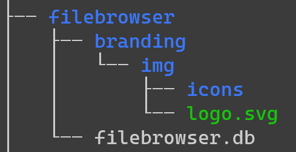

# Instação do FileBrowser

## Gerenciador de arquivos para servidores

### Documentação oficial

[Instalação](https://filebrowser.org/installation)

[Custom Branding](https://filebrowser.org/configuration/custom-branding)

## Pré requisitos

- curl

`sudo apt install curl`

## Unix install

- Criar um diretório para armazenar todas as configurações

*É por este diretório que o projeto deverá ser inicializado*

- No terminal digite:  
`curl -fsSL https://raw.githubusercontent.com/filebrowser/get/master/get.sh | bash
filebrowser -r /path/to/your/files`

### Configurando o branding

- Criar diretório **branding**

*Esta é a estrutura de pastas que deverá ser seguida*

- No terminal digite:  
`filebrowser config set --branding.name "Seu Nome" \
    --branding.files "/caminho/absoluto/para/diretorio" \
    --port 5432 \
    --address "0.0.0.0"`

- **--branding-name:** *define o nome do gerenciador de arquivos na web*

- **--branding-files:** *define o caminho para o diretório que contém os arquivos de personalização*

- **--port:** *define a porta em que o serviço roda na máquina*

- **--address:** *define o ip que poderá acessar o serviço atravéz da rede (0.0.0.0 => todos os ip's)*
